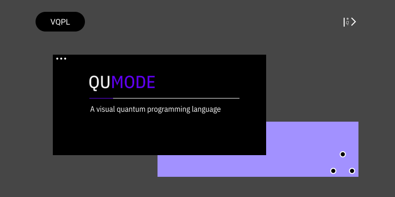

QUMODE
========

For instance:

This is the documentation of the Qumode visual programming language.

What is Qumode?
    Qumode is lets users create programs by manipulating program elements graphically rather than by specifying them textually.
    Qumode has a visual syntax instead of textual sntax, but we are looking into introducing dual-syntax,
    similar to that of Python. It is statically typed though hence a bit more strict with compile time errors.

Why Visual Scripting?
    Visual Scripting Languages lets users create programs by manipulating program elements graphically rather than by specifying them textually.
    Qumode as a name was inspired by the article , `the power of one qumode
    <https://arxiv.org/abs/1510.04758>`_  
    With the popularity of quantum computing increasing, tools that offer diverse user experience of programming are essential.
    Unlike typical programming languages that target robust and  but I have found them to be lacking in abstractions and many even exposing hardware primitives making them unfriendly to the novice developer.        

Features
--------

- Gate Visualisation
- Do matrix operations on gates

.. glossary::
     apical
        at the top of the plant.

Installation
------------

For now there is no installation, only a web interface is provided.

Contribute
----------

This is an open source project, and thus you can contribute on the 
`Qumode
<https://github.com/qumode/>`_ official repository.

- Source Code: github.com/qumode

License
-------

The project is licensed under the MIT license.

``The documentation is still under construction``

